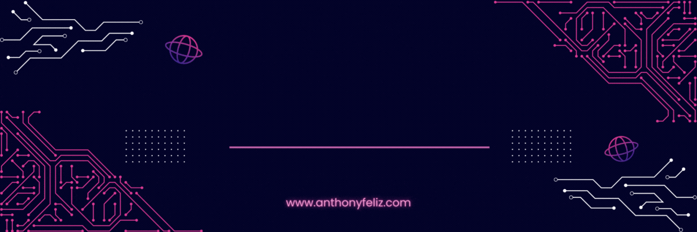

  
  
  

### <abbr title="Full Stack Software Engineer · NYC · Georgia Tech">Hi, I'm Anthony Feliz <picture><source srcset="https://fonts.gstatic.com/s/e/notoemoji/latest/1f44b_1f3fe/512.webp" type="image/webp"></picture></abbr>

* <picture><source srcset="https://fonts.gstatic.com/s/e/notoemoji/latest/1f442_1f3fe/512.webp" type="image/webp"></picture> My name is Anthony Feliz.
* <picture><source srcset="https://fonts.gstatic.com/s/e/notoemoji/latest/2699_fe0f/512.webp" type="image/webp"></picture> Full Stack Software Engineer based in New York City.
* <picture><source srcset="https://fonts.gstatic.com/s/e/notoemoji/latest/1f916/512.webp" type="image/webp"></picture> Pursuing an M.S. in Computer Science at Georgia Tech.
* <picture><source srcset="https://fonts.gstatic.com/s/e/notoemoji/latest/1f91d_1f3fe/512.webp" type="image/webp"></picture> Open to collaborating on interesting open source projects.

<h3 align="left">Languages & Tools:</h3>

<table>
  <tr>
    <td><b>Languages</b></td>
    <td>
      
      
      
      
      
      
    </td>
  </tr>
  <tr>
    <td><b>Frameworks</b></td>
    <td>
      
      
      
      
      
      
      
      
    </td>
  </tr>
  <tr>
    <td><b>Databases & Cloud</b></td>
    <td>
      
      
      
      
    </td>
  </tr>
  <tr>
    <td><b>Tools</b></td>
    <td>
      

        
        
      

    </td>
  </tr>
</table>

<h3 align="left">AI Tools:</h3>

  
  
  

<table>
  <tr>
    <td></td>
    <td></td>
  </tr>
</table>

  

